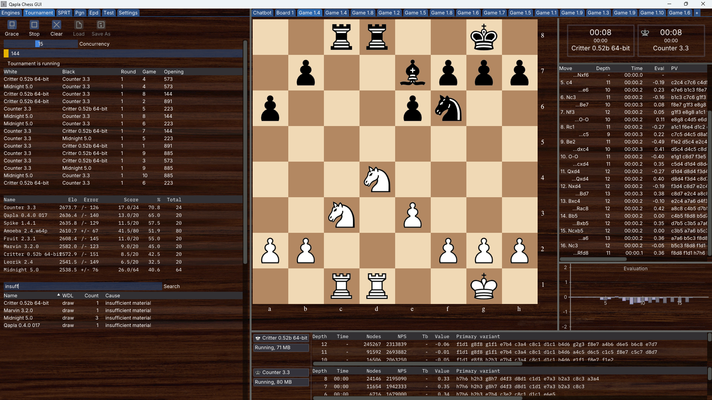
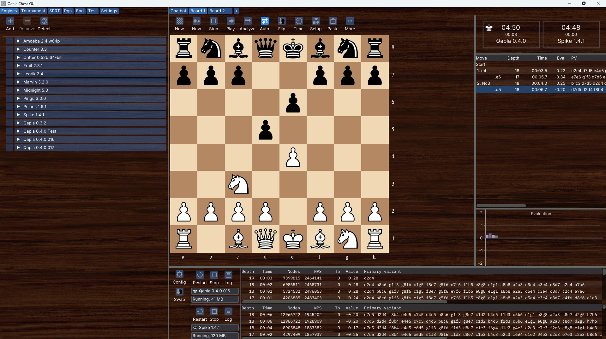
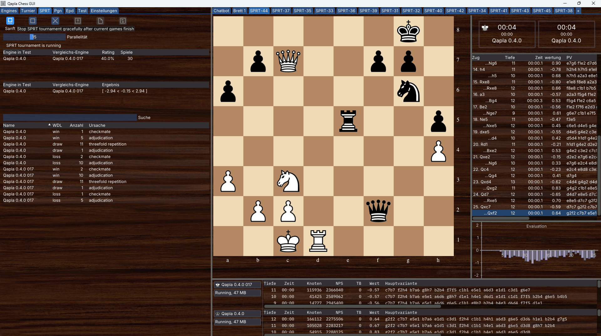

# qapla-chess-gui

A modern chess GUI with engine support, written in C++ using OpenGL and ImGui.

## Overview

**Qapla Chess GUI** is a professional-grade chess interface specifically designed for **chess engine developers** and **engine testers**. While it can be used for regular chess play, its primary focus is on providing powerful tools for engine development, testing, and tournament management.

### Key Features

#### Tournament Management
- **Parallel Tournament Execution** - Run multiple tournaments simultaneously with up to 32 parallel games
- **SPRT Testing** (Sequential Probability Ratio Test) - Statistical engine comparison with parallel game execution
- **Resumable & Extendable** - Tournaments can be interrupted and resumed later, or extended with additional rounds
- **Gauntlet & Round-Robin** formats with comprehensive rating tracking
- **Live Monitoring** - Watch any ongoing game via tab-based interface; switch between games in real-time
- **Result Matrix** - View comprehensive tournament results in matrix format via chatbot
- **Interactive Chatbot** - Get help using the GUI with the integrated assistant

#### Position Analysis
- **Multi-threaded EPD Analysis** - Analyze positions from EPD files using multiple engines in parallel
- **UCI Engine Testing** - Comprehensive engine compliance and behavior validation
- **Extensive Logging** - Detailed protocol communication and engine behavior tracking
- **Auto-detect Opening Formats** - Automatic detection of opening file formats (PGN, EPD, FEN)

#### Game Management
- **PGN Support** - Load, filter, and analyze PGN game databases with proper time control handling
- **Multiple Board Workspaces** - Open and manage multiple games/positions simultaneously via tabs
- **Advanced Filtering** - Search and filter games by various criteria with persistent filter states
- **Detailed Tab Information** - Hover tooltips showing round, game, engines, and position details

#### User Experience
- **Integrated Tutorial** - Built-in help system with clear button for new users
- **Comprehensive Settings** - All features of the command-line engine tester accessible via GUI
- **Real-time Control** - Adjust concurrency, monitor progress, and control running tournaments on the fly
- **Modern Interface** - Clean, responsive UI with OpenGL rendering
- **Multilingual Support** - Localization support (English, Deutsch, Français) with language selector in Settings
- **Comprehensive Tooltips** - Helpful tooltips on all controls
- **Smart File Dialogs** - File filtering by appropriate extensions for tournaments and SPRT tests
- **HTTP Remote Control** - Drive the running GUI from a script or another program with `--remote-control`; everything it starts is played in the visible window (see [Command Line Options](#command-line-options))
- **Remote Desktop Optimization** - Option to reduce GUI resource usage when using remote desktop on Linux

## Screenshots

### Tournament Management

The tournament interface provides comprehensive control and monitoring capabilities. Concurrency can be adjusted at any time via slider during tournament execution. Multiple tables display running games, Elo ratings with error margins (±), and game termination reasons. All running games can be monitored either through tabs or by selecting from the running games table. The termination reasons table supports full-text search for analysis.



*Tournament interface showing concurrent games, Elo ratings, and termination analysis*

### Board Analysis with Multiple Engine Setups

Multiple classic chess boards with different engine configurations can be used in parallel, even while tournaments are running. This is particularly useful for engine developers: principal variations (PV) can be copied with a mouse click and pasted into another board, where the variation can be stepped through move by move.



*Board workspace with engine analysis and PV navigation capabilities*

### SPRT Tournament with Parallel Games

The GUI supports running multiple games in parallel during SPRT tournaments. You can switch between the currently running games using the tab control at the top of the board workspace.



*SPRT tournament running 15 parallel games with real-time game monitoring*

### Architecture

All tournament and testing capabilities are powered by the integrated **[qapla-engine-tester](https://github.com/Mangar2/qapla-engine-tester)** engine, which provides:
- UInstallation

**No installation required!** The compiled executable is a self-contained, portable application.

### How to Use

1. Build the executable using the build instructions below
2. Copy the resulting executable from the build directory to any location
3. Run it directly - all dependencies are statically linked and fonts/assets are embedded

**Windows:**
- Copy `qapla-chess-gui.exe` from the build directory
- Run directly by double-clicking

**Linux:**
- Copy `qapla-chess-gui` from the build directory
- Make executable if needed: `chmod +x qapla-chess-gui`
- Run directly: `./qapla-chess-gui`
- Works on X11 window systems

**macOS:**
- Copy `qapla-chess-gui` from the build directory
- Run directly: `./qapla-chess-gui`

### Command Line Options

The GUI starts without any arguments; the options below exist for driving it from scripts and
other programs. `--help` prints the same list and exits without opening a window:

```bash
qapla-chess-gui --help
```

| Option | Meaning |
| --- | --- |
| `--help`, `-h`, `/?` | Print the option list and exit. The GUI does not start. |
| `--config-dir=<path>` | Keep everything this session stores in `<path>` instead of the per-user configuration directory. Created if it is not there. See [Running against a configuration of its own](#running-against-a-configuration-of-its-own). |
| `--remote-control` | Serve the GUI's tools over HTTP on `127.0.0.1`, so another program can drive the running window. Off unless given. |
| `--remote-control-port=<port>` | Port of the remote control (default `8137`). `0` asks the operating system for a free one, which the Remote Control panel then reports. |
| `--remote-control-token=<token>` | Shared secret every caller has to send as `Authorization: Bearer <token>`. Without it, any program on this machine may drive the GUI. |

Values are written with an equals sign. A misspelled option or a value passed with a space
(`--remote-control-port 8137`) is reported on stderr and the GUI still starts, so a typo never
costs more than a wrong setting.

All options live in one table in [`src/command-line.cpp`](src/command-line.cpp), and that table is
what `--help` prints — a new option appears in the help output by being added there.

#### Running against a configuration of its own

Everything the GUI keeps between sessions lives in one per-user directory
(`%LOCALAPPDATA%\qapla-chess-gui` on Windows, `~/.qapla-chess-gui` on Linux and macOS):
`qapla-chess-gui.ini` with the engine list and every window's settings, EPD results, the chat and
finetuning logs, the auto-saved PGN. `--config-dir` points all of it somewhere else for one run:

```bash
qapla-chess-gui --config-dir=/tmp/qapla-run-42
```

This is what an automated test run uses. It buys two different things:

- **The configuration you work with is not touched.** The GUI saves its state when it ends, so
  without this a test run writes its own settings over yours.
- **The run starts from a known state.** A fresh directory is a fresh installation. Without it, a
  test silently depends on what the last real session happened to leave behind — which is the
  difference between a test that passes and a test that proves something.

A directory that cannot be created ends the start rather than quietly falling back on your own
configuration, since avoiding exactly that is the point of the switch. The window layout
(`imgui.ini`) follows along; without the switch it stays next to the working directory, where
ImGui puts it.

The GUI test suites are run by starting the executable with `QAPLA_AUTO_RUN_TESTS` set — they are
then played automatically and the process ends with a summary line on stdout:

```bash
QAPLA_AUTO_RUN_TESTS=1 qapla-chess-gui --config-dir=/tmp/qapla-run-42
# QAPLA_TEST_SUMMARY tested=54 success=54 inQueue=0
```

The exit code is 0 only when every registered test ran and passed, so a release script can gate on
it. Started without `--config-dir`, the run says on stderr that it is using — and will overwrite —
your own configuration.

#### Remote Control over HTTP

`--remote-control` puts an HTTP server in front of the same tools the built-in AI chat uses.
Everything started this way runs in the visible GUI: the games appear on the boards, the tables
fill in, and the *Remote Control* panel logs every call with its result. The server binds
`127.0.0.1` only and is never reachable from another machine.

```bash
qapla-chess-gui --remote-control --remote-control-token=secret
curl -H "Authorization: Bearer secret" http://127.0.0.1:8137/status
```

| Endpoint | Purpose |
| --- | --- |
| `GET /health` | Answers `{"ok":true}` without touching the GUI, so "the app is up" can be told from "the app is busy". The only endpoint that works without the token. |
| `GET /tools` | The available tools, in the same OpenAI function-calling shape the local chat uses. |
| `POST /tools/<name>` | Body is the arguments object; answers `{"ok":…, "content":…}` once the GUI has actually done it. |
| `GET /status` | Shortcut for `POST /tools/get_status` with no arguments. |
| `GET /wait?type=<tournament\|sprt\|epd\|clop>[&timeout=<seconds>]` | Does not answer until that activity has stopped, then reports why (`finished`, `stopped`, `timeout`, `closed`, `not_running`) together with the full status, results included. Timeout defaults to 300 s and is clamped to 1…3600 s. |
| `POST /shutdown` | Asks the application to close, exactly as the window's close button does — so what the session stored is written out properly. Not a tool: `close_application` stays local-only, because a caller watching the GUI has no business ending it, while a test harness does. |

With `--remote-control-port=0` the operating system picks a free port. It is reported in two
places: as a line on stdout (`QAPLA_REMOTE_CONTROL port=…`) for anyone reading a log, and in
`remote-control.port` in the configuration directory for a program that has to read it back —
stdout is not dependable for that on Windows, where the executable has no console unless it
inherits one. The file is removed when the server stops.

Tournaments, SPRT runs, EPD analysis and CLOP parameter tuning can all be started, watched and
read back this way, while the window stays usable by hand.

A finished run is kept with `save_results` and brought back with `load_results`, which take the
path as an argument rather than opening the file picker the *Load* and *Save As* buttons use — a
native dialog has nobody to answer it when the caller is a script. Tournament and SPRT write the
same `.qtour`/`.qsprt` file those buttons write, configuration and results together; EPD writes
its per-position results only, so reading one back needs the same EPD file still configured. Both
are refused while that run is going.

### Configuration Files

The application creates a configuration directory on first run:
- **Windows:** `%USERPROFILE%\.qapla-chess-gui\`
- **Linux:** `~/.qapla-chess-gui/`
- **macOS:** `~/.qapla-chess-gui/`

This directory contains:
- `qapla-chess-gui.ini` - User settings
- Language files (`.lang`) for translations
- Log files

## Supported Platforms

- **Windows** (tested)
- **Linux** (X11 with CMake support, tested)
- **macOS** (with Clang/LLVM, tested
**No installation required!** The compiled executable is a self-contained, portable application. Simply copy the executable file anywhere and run it directly from that location. All fonts and assets are embedded in the binary.

## Supported Platforms

- **Windows** (tested)
- **Linux** (X11 with CMake support)
- **macOS** (with Clang/LLVM)

## Build

This project uses [CMake](https://cmake.org) with [Presets](https://cmake.org/cmake/help/latest/manual/cmake-presets.7.html), [Ninja](https://ninja-build.org), and `clang++`.

### Prerequisites

- CMake ≥ 3.20
- Ninja
- Clang/LLVM (clang++)
- Git

### Clone with Submodules

```bash
git clone --recurse-submodules https://github.com/Mangar2/qapla-chess-gui.git
cd qapla-chess-gui
```

### Build Commands

**Debug Build:**
```bash
cmake --preset default
cmake --build --preset default
```

**Release Build:**
```bash
cmake --preset release
cmake --build --preset release
```

**Diagnostic Engine:**
```bash
cmake --preset default
cmake --build --preset diagnostic
```

## Testing

Three layers, cheapest first. All of them keep to a configuration directory of their own, so
running them never changes — and never depends on — the configuration you work with.

| Layer | Checks | How to run |
|---|---|---|
| Unit | Logic without a GUI | `./build/default/unit-tests` |
| Integration | Whole flows against the running application, driven over the HTTP remote control | `python3 test/integration/test_runner.py` |
| GUI | What only mouse and keyboard can check: board, dialogs, tutorial | `QAPLA_AUTO_RUN_TESTS=1 ./build/default/qapla --config-dir=<a directory of its own>` |

```bash
python3 scripts/release-check.py   # build, then all three, stopping at the first failure
```

Every one of them reports its verdict through the exit code, so a release script can gate on it
instead of reading output. The integration suite has a
[readme of its own](test/integration/README.md) and a list of
[what it covers](test/integration/tests.md).

## External Dependencies

This project uses the following libraries as Git submodules in the `extern/` directory:

- **[GLFW](https://github.com/glfw/glfw)** - Window and input management (zlib/libpng License)
- **[ImGui](https://github.com/ocornut/imgui)** - Immediate Mode GUI (MIT License)
- **[GLAD](https://github.com/Dav1dde/glad)** - OpenGL Loader (MIT License)
- **[stb](https://github.com/nothings/stb)** - Image loading (Public Domain)
- **[qapla-engine-tester](https://github.com/Mangar2/qapla-engine-tester)** - Engine testing framework
- **[fastchess SPRT](https://github.com/Disservin/fastchess)** - SPRT algorithms for statistical engine testing (MIT License)

Sources are automatically included via Git submodules and compiled with CMake.

## Fonts

The GUI uses embedded fonts (see `src/font.h` and `src/font.cpp`):

- **Chess Merida Unicode** - Chess piece rendering (Public Domain / Unlicense)
  - Source: `fonts/chess_merida/`
- **Inter Variable** - Modern UI font (SIL Open Font License 1.1)
  - Source: `fonts/inter/`
- **IBM Plex Mono** - Monospace font for code/lists (SIL Open Font License 1.1)
  - Source: `fonts/ibm_plex_mono/`

All fonts are embedded in the binary and require no external installation.

## Graphical Assets

### Background Texture

The project uses the "Dark Wood" texture from [Poly Haven](https://polyhaven.com):

- **License:** CC0 (100% Free)
- No attribution required
- No restrictions for commercial or private use
- Embedded in `src/dark-wood-background.cpp`

From the Poly Haven website:
> "100% Free - Not just free, but CC0, meaning you can use them for absolutely any purpose without restrictions. No paywalls or signup required, simply download what you want and use it immediately without worry."

## License

This project is licensed under the [GNU GPL v3](LICENSE).  

The external libraries and assets used have their own respective licenses:

- **Own Components:** GNU GPL v3
- **GLFW:** zlib/libpng
- **ImGui:** MIT
- **GLAD:** MIT
- **stb:** Public Domain
- **fastchess SPRT:** MIT
- **Chess Merida Font:** Public Domain (Unlicense)
- **Inter Font:** SIL Open Font License 1.1
- **IBM Plex Mono:** SIL Open Font License 1.1
- **Dark Wood Texture:** CC0 (Public Domain)
